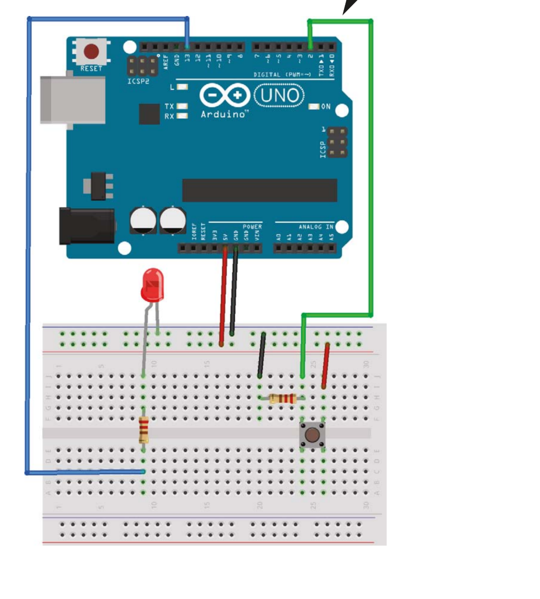
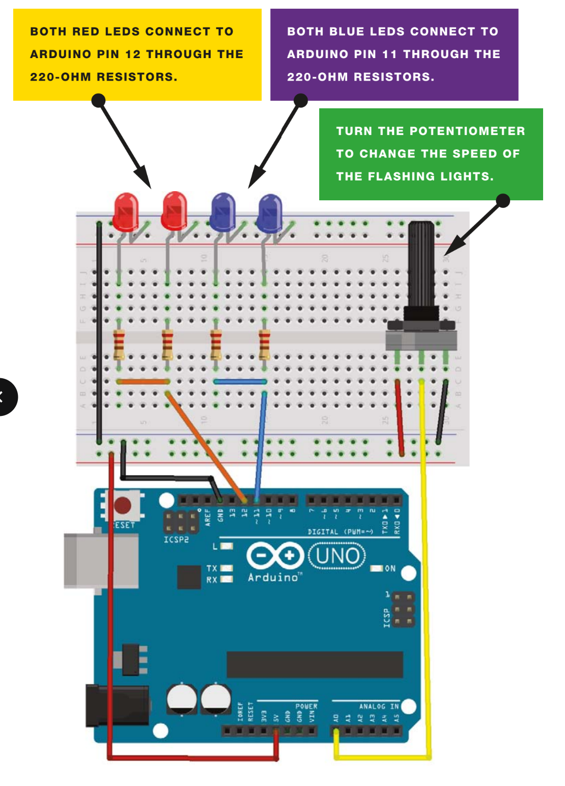
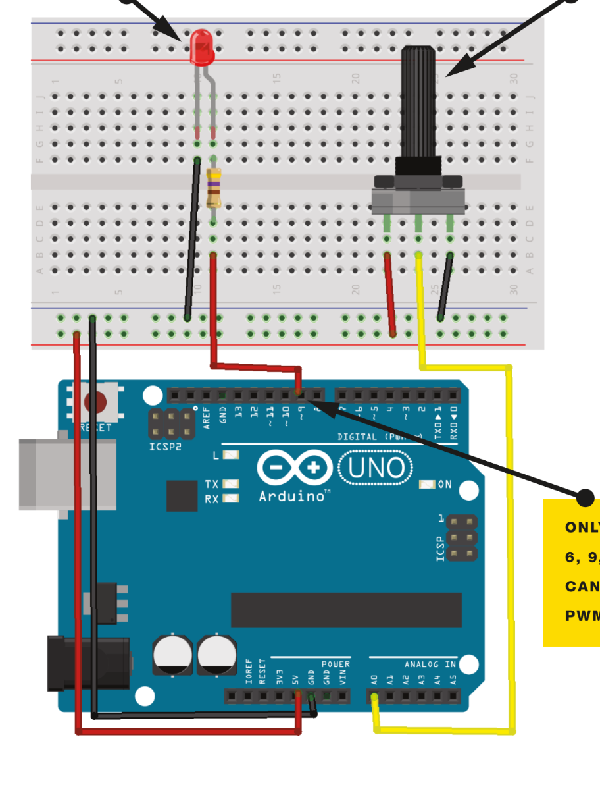
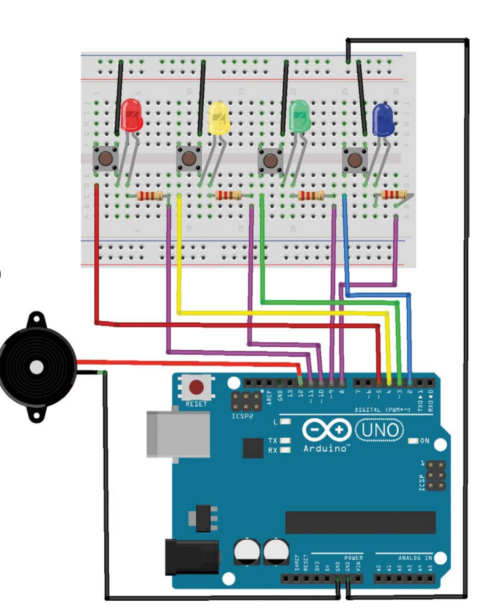
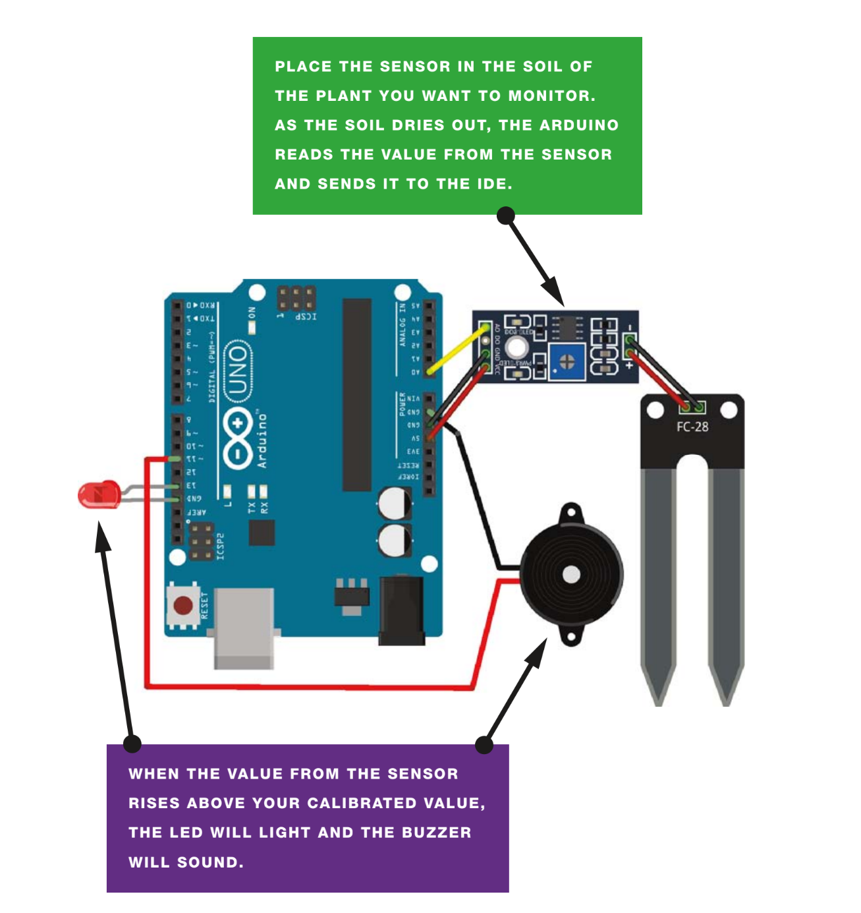

<div align="center">

[](https://git.io/typing-svg)

### *Embedded Systems Engineering · Hardware Programming · Sensor Integration*

[](https://www.arduino.cc/)
[](https://isocpp.org/)
[](LICENSE)
[]()
[]()

<br>

> *A curated collection of hands-on Arduino and embedded systems projects covering hardware control, sensor integration, PWM signal management, and interactive game logic — built to demonstrate practical embedded engineering skills.*

<br>

---

</div>

## 📖 Introduction

Welcome to my **Arduino Projects Collection** — a portfolio of embedded systems projects built using the **Arduino platform**, **Embedded C/C++**, and a range of electronic components and sensors.

Each project targets a specific concept in embedded development: from basic button-controlled GPIO, to PWM-based dimming, analog sensor reading, and multi-component game logic. These are honest learning projects that reflect my progression as a **Computer Science student specializing in Embedded Systems** — built, tested, and documented on real hardware.

Every project folder is self-contained and includes the full Arduino source code (`.ino`), a circuit image, a recorded demo video, and an animated GIF — making it easy to review each project without setting up the hardware.

<br>

---

## 🚀 Featured Project

<div align="center">

### 🧠 Memory Game — Simon Says on Arduino

> The most complete project in this collection: a Simon Says-style memory game with growing LED sequences, button input, buzzer feedback, and win/loss detection — all implemented in embedded C on a bare Arduino board.


*[Jump to full project details ↓](#-04---memory-game)*

</div>

<br>

---

## 📂 Repository Overview

```
Arduino-Projects-Collection/
│
├── 📁 Controlled-LED/
│   ├── Controlled_LED.ino
│   ├── circuit.png
│   └── demo.gif
│
├── 📁 Disco-Strobe-Light/
│   ├── Disco_Strobe_Light.ino
│   ├── circuit.png
│   └── demo.gif
│
├── 📁 Light-Dimmer/
│   ├── Light_Dimmer.ino
│   ├── circuit.png
│   └── demo.gif
│
├── 📁 Memory-Game/
│   ├── Memory_Game.ino
│   ├── circuit.png
│   └── demo.gif
│
├── 📁 Plant-Monitor/
│   ├── Plant_Monitor.ino
│   ├── circuit.png
│   └── demo.gif
│
└── README.md
```

<br>

---

## 🛠️ Technologies & Tools

<div align="center">

| Category | Details |
|:---|:---|
| 🖥️ **Microcontroller** | Arduino Uno / Nano / Mega |
| 💻 **IDE** | Arduino IDE 2.x |
| 🔤 **Language** | Embedded C / C++ |
| 📡 **Communication** | Serial Monitor (UART) |
| ⚡ **Techniques** | PWM, Digital I/O, Analog Read, Button Polling |
| 🔬 **Sensors** | Soil Moisture Sensor, Photoresistor (LDR) |
| 💡 **Actuators** | LEDs, Buzzers, Push Buttons |
| 🔌 **Electronics** | Resistors, Capacitors, Breadboard, Jumper Wires |
| 📐 **Circuit Design** | Schematic design & prototyping |

</div>

<br>

---

## 🚀 Project Showcase

<div align="center">

| # | Project | Description | Key Concepts | Difficulty |
|:--:|:---|:---|:---|:--:|
| 01 | 💡 [Controlled LED](#-01---controlled-led) | Precise LED control via digital output | Digital I/O, GPIO | ⭐ |
| 02 | 🪩 [Disco Strobe Light](#-02---disco-strobe-light) | Rapid multi-LED strobe sequencing | Timing, Loops, Arrays | ⭐⭐ |
| 03 | 🔆 [Light Dimmer](#-03---light-dimmer) | Smooth LED brightness via PWM | PWM, analogWrite | ⭐⭐ |
| 04 | 🧠 [Memory Game](#-04---memory-game) | Simon-style pattern recall game | Logic, Arrays, UX | ⭐⭐⭐ |
| 05 | 🌱 [Plant Monitor](#-05---plant-monitor) | Soil moisture sensing with alerts | Sensors, Automation | ⭐⭐⭐ |

</div>

<br>

---

## 📋 Project Details

---

### 💡 01 - Controlled LED

> **Category:** Digital Input & Output | GPIO Control

A foundational project demonstrating LED control through a **push button input**. When the button is pressed, the Arduino reads the digital input signal and toggles the LED on or off accordingly — reinforcing the core input/output relationship at the heart of embedded systems programming.

**Concepts Demonstrated:**
- `pinMode()`, `digitalRead()`, and `digitalWrite()` functions
- Digital input reading and output switching
- Button state detection in the main loop
- Setup/loop firmware architecture

**Circuit Preview:**



**Animated Demo:**


---

### 🪩 02 - Disco Strobe Light

> **Category:** LED Sequencing | Timing Control

An energetic multi-LED strobe sequencer that rapidly cycles through light patterns, simulating a disco strobe effect. This project demonstrates array-based LED management, precise microsecond-level timing, and the use of loops to produce dynamic lighting sequences.

**Concepts Demonstrated:**
- LED array management
- High-frequency strobe timing (`delayMicroseconds`)
- Pattern sequencing with `for` loops
- Non-blocking delay techniques

**Circuit Preview:**



**Animated Demo:**


---

### 🔆 03 - Light Dimmer

> **Category:** PWM | Analog Output

A hardware-level light dimmer that uses **Pulse Width Modulation (PWM)** to achieve smooth, continuous control of LED brightness. Brightness levels are controlled via a potentiometer, with the analog input mapped to PWM output values in real time — demonstrating core embedded signal processing.

**Concepts Demonstrated:**
- PWM signal generation with `analogWrite()`
- Analog input reading with `analogRead()`
- Input-to-output value mapping (`map()` function)
- Real-time signal adjustment

**Circuit Preview:**



**Animated Demo:**


---

### 🧠 04 - Memory Game

> **Category:** Game Logic | Interactive Systems

A fully interactive **Simon Says**-style memory game implemented entirely in embedded C on Arduino. The system generates and displays a growing LED sequence that the player must reproduce using push buttons. Includes difficulty escalation, win/loss detection, and audio feedback via a buzzer.

**Concepts Demonstrated:**
- State machine design
- Random sequence generation
- Button debouncing
- Multi-LED and buzzer coordination
- Game loop logic and user interaction

**Circuit Preview:**



**Animated Demo:**


---

### 🌱 05 - Plant Monitor

> **Category:** Sensor Integration | Embedded Automation

An automated plant health monitoring system that reads **soil moisture levels** using an analog capacitive sensor and triggers an alert (LED indicator + buzzer) when soil moisture drops below a defined threshold. Data is also streamed to the Serial Monitor for real-time observation.

**Concepts Demonstrated:**
- Analog sensor integration
- Threshold-based decision logic
- Serial communication for data logging
- Embedded automation using polling-based sensor reads

**Circuit Preview:**



**Animated Demo:**


---

## 🧰 Hardware Components Used

<div align="center">

| Component | Purpose |
|:---|:---|
| Arduino Uno / Nano | Main microcontroller board |
| LEDs (various colors) | Visual output and indicators |
| Push Buttons | User input and game interaction |
| Potentiometer (10kΩ) | Analog input for light dimming |
| Soil Moisture Sensor | Plant hydration monitoring |
| Passive Buzzer | Audio feedback and alerts |
| Resistors (220Ω, 10kΩ) | Current limiting and pull-down |
| Breadboard | Prototyping and circuit assembly |
| Jumper Wires | Component interconnection |
| USB Cable (Type-B) | Power delivery and serial communication |

</div>

<br>

---

## 💻 Software Used

<div align="center">

| Tool | Purpose |
|:---|:---|
| [Arduino IDE 2.x](https://www.arduino.cc/en/software) | Primary development environment |
| Arduino Serial Monitor | Real-time sensor data logging |
| Fritzing / Tinkercad | Circuit schematic design |
| OBS Studio | Demo video recording |
| GIMP / ScreenToGif | Animated GIF generation |

</div>

<br>

---

## 🎯 Skills Demonstrated

```
✅ Embedded C/C++ Programming       ✅ PWM Signal Control
✅ GPIO Digital & Analog I/O        ✅ Sensor Integration & Calibration
✅ Real-Time System Design          ✅ State Machine Implementation
✅ Hardware Debugging & Prototyping ✅ Serial Communication (UART)
✅ Circuit Design & Assembly        ✅ Button Input & Polling Logic
✅ Component Datasheet Reading      ✅ Embedded Automation
```

<br>

---

## 📸 Screenshots

<div align="center">

| Controlled LED | Disco Strobe | Light Dimmer |
|:---:|:---:|:---:|
|  |  |  |

| Memory Game | Plant Monitor |
|:---:|:---:|
|  |  |

</div>

<br>

---

## 🎬 Animated GIF Demos

<div align="center">

**💡 Controlled LED**


---

**🪩 Disco Strobe Light**


---

**🔆 Light Dimmer**


---

**🧠 Memory Game**


---

**🌱 Plant Monitor**


</div>

<br>

---

## 🎓 Learning Outcomes

Through building and documenting these projects, the following practical skills were developed and reinforced:

- **Embedded Programming Fundamentals** — Writing clean firmware in C/C++ for microcontrollers with limited RAM and flash, following the setup/loop structure of the Arduino runtime.
- **PWM & Analog Signal Control** — Using `analogWrite()` and `analogRead()` to bridge the gap between digital microcontrollers and analog real-world signals.
- **Sensor-Driven Automation** — Reading raw analog sensor values and acting on them through threshold comparisons to drive output peripherals.
- **State Machine Design** — Structuring interactive systems like the Memory Game into clearly defined states with predictable transitions and clean logic flow.
- **Hardware Debugging** — Diagnosing issues where software behavior and physical circuit conditions interact — a core embedded systems skill.
- **Technical Documentation** — Producing circuit diagrams, commented source code, and multimedia project walkthroughs suitable for portfolio and professional review.

<br>

---

## 🔭 Future Improvements

- [ ] 🌐 Migrate the Plant Monitor to an **ESP32** for Wi-Fi connectivity and cloud data logging
- [ ] 📱 Add a **Bluetooth serial interface** to the Memory Game for score tracking on a phone
- [ ] 📊 Integrate an **OLED display (SSD1306)** into the Plant Monitor for local readout
- [ ] ⏱️ Refactor timing-sensitive code to use `millis()` instead of `delay()` for non-blocking logic
- [ ] 🧪 Add basic **software testing** with assertion checks via Serial output
- [ ] 🏗️ Design simple **PCB layouts** using EasyEDA for a cleaner, breadboard-free version
- [ ] 🌡️ Extend the Plant Monitor with a **DHT11 temperature/humidity sensor** for richer data

<br>

---

## 📬 Contact

<div align="center">

Feel free to reach out for collaboration, questions, or professional opportunities.

[](https://github.com/youseffahem)
[](https://www.linkedin.com/in/yousef-fahem/)
[](mailto:yousef.fahem11@gmail.com)

</div>

<br>


</div>

<br>

---

<div align="center">

### ⭐ If you found this repository useful, please consider giving it a star!

*Built with curiosity, a soldering iron, and a lot of Serial.println() debugging.*

<br>


---


</div>
